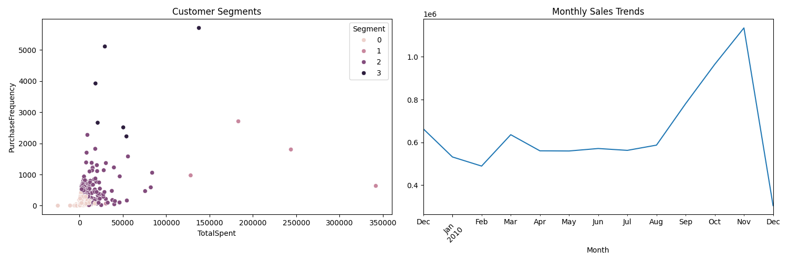

# E-commerce Customer Segmentation and Marketing Analysis

## Project Overview
This project analyzes an online retail dataset to create customer segments and develop targeted marketing strategies. Using machine learning techniques, we identify distinct customer groups and their purchasing patterns to provide actionable insights for business growth.

## Dataset
The dataset contains online retail transactions including:
- Customer ID
- Products purchased
- Purchase amount
- Transaction date
- Country information

## Analysis Components

### 1. Customer Segmentation
We segment customers into 4 distinct groups based on:
- Purchase frequency
- Total spending
- Number of items bought

The segments identified are:
- Segment 0: High-value loyal customers
- Segment 1: Mid-tier regular customers
- Segment 2: Occasional buyers
- Segment 3: New or one-time customers

### 2. Purchase Pattern Analysis
- Monthly sales trends
- Geographic distribution of sales
- Popular product categories
- Peak purchasing times

### 3. Marketing Strategy Recommendations
Based on the analysis, we recommend:
1. **For High-value Customers:**
   - Premium loyalty programs
   - Early access to new products
   - Personalized service

2. **For Mid-tier Customers:**
   - Targeted promotions
   - Loyalty rewards
   - Cross-selling campaigns

3. **For Occasional Buyers:**
   - Re-engagement emails
   - Special discounts
   - Product recommendations

4. **For New Customers:**
   - Welcome offers
   - Educational content
   - Easy return policies

## Technical Implementation
- Python for data analysis
- Scikit-learn for customer segmentation
- Pandas for data manipulation
- Matplotlib and Seaborn for visualization

## Results


## Interactive Dashboard
The project includes an interactive dashboard built with Streamlit that provides:
- Dynamic customer segmentation visualization
- Real-time sales analysis
- Product performance metrics
- Search functionality
- Customizable date ranges and segment numbers

To run the dashboard:
```bash
streamlit run app.py
```

## Getting Started
1. Clone this repository
2. Install required packages:
   ```bash
   pip install -r requirements.txt
   ```
3. Run the analysis:
   ```bash
   python main.py
   ```

## Future Improvements
- Implement more advanced clustering algorithms
- Add time-series analysis for better forecasting
- Include product category-based analysis
- Develop a recommendation system

## Contributing
Feel free to fork this project and submit improvements via pull requests.

## License
This project is licensed under the MIT License - see the LICENSE file for details. 